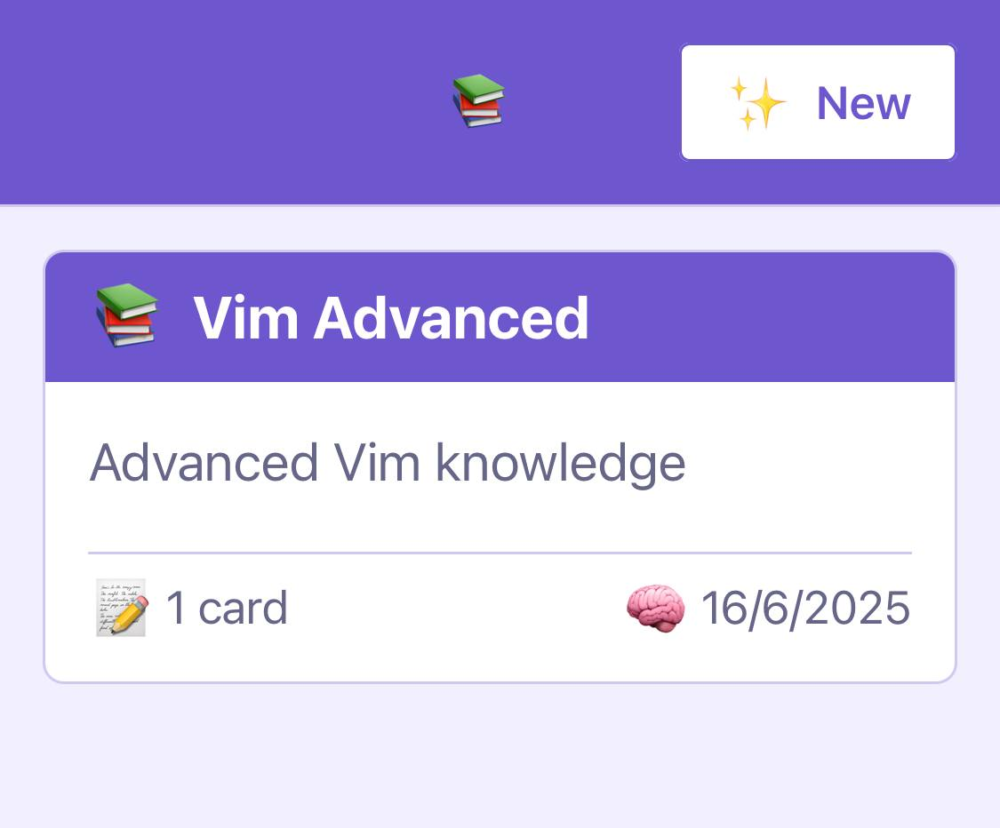

# SoAnki

🧠 Soanki is a mobile application designed to help users learn 📖 new skills using the spaced 🔁 repetition method with anki cards. Built with 🙏 React Native and Expo, it offers a simple yet effective way to create and study flashcards.

🌀 **VibeCode™**

<p float="left">
  
  
</p>

## Features ✅

- Create custom anki card decks
- Add cards with questions and answers to your decks
- Study cards using a spaced repetition system
- Track your learning progress
- Simple and intuitive user interface

## Getting Started

### Prerequisites 👨‍🚀

- Node.js (v14 or later)
- npm or yarn
- Expo CLI
- iOS Simulator or an iOS device for testing

### Installation 🤞

1. Install dependencies 
```
npm install
```

2. Start the development server
```
npm start
```

3. Open the app in iOS simulator or on your device by scanning the QR code with the Expo Go app
